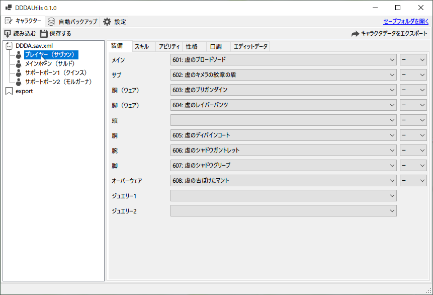
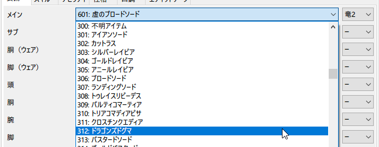
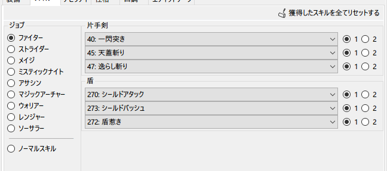
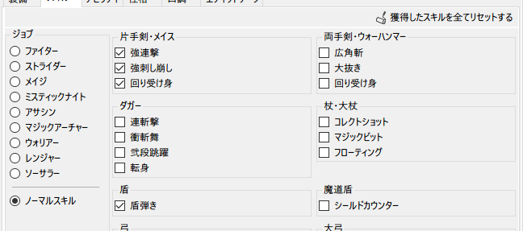
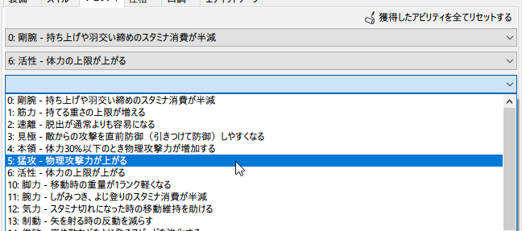
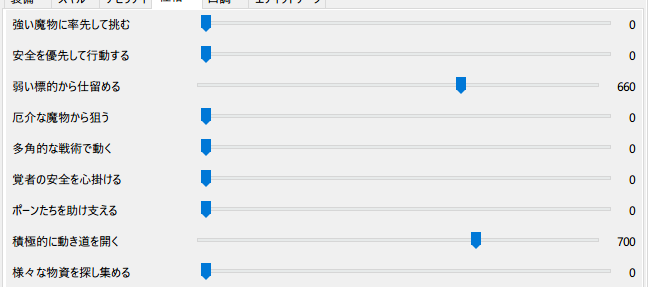
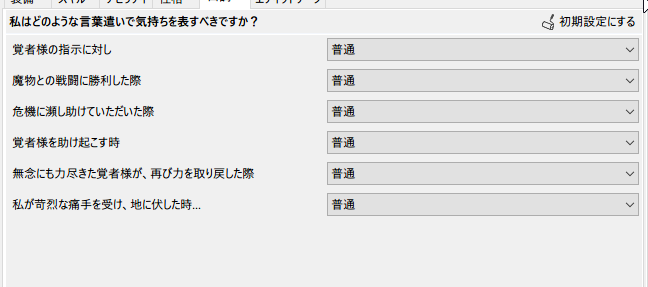
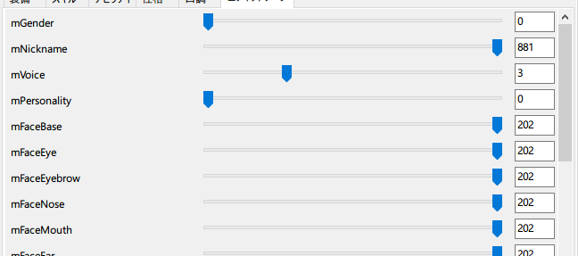

# DDDAUtils

## Overview

DDDAのセーブデータを弄るツールです

通常あり得ないデータを設定することが出来ますが場合によってはクラッシュしますので、ご使用は自己責任でお願いします

## Feature

### 装備を編集する機能

### スキルを編集する機能

### アビリティを編集する機能

### 性格を編集する機能

※プレイヤーの場合は機能しません

### 口調を編集する機能

※プレイヤーの場合は機能しません

### エディットデータを編集する機能

サヴァン、サルド、クインス、モルガーナ、ルーク、あとローカルサポートポーンを拝見していると、エディットでは設定できないパラメータが使用されています。

下手に触るとクラッシュしますので、声だけとか絞って使うと吉。

### キャラクタデータをエクスポート、インポートする機能

### セーブデータのバックアップ機能

## Notice
- アイコンは [ICOOON MONO](https://icooon-mono.com
) 様のものを使用しています  
再配布は禁止事項に当たるためリポジトリで管理していません  
ビルドする場合は上記サイトから取得するか代替のアイコンをご用意ください

## Licence

[MIT](https://github.com/hananoki/x2FOJP/blob/master/LICENSE.md)